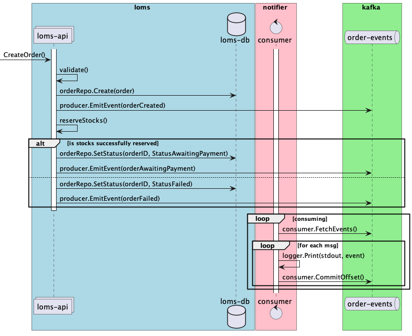
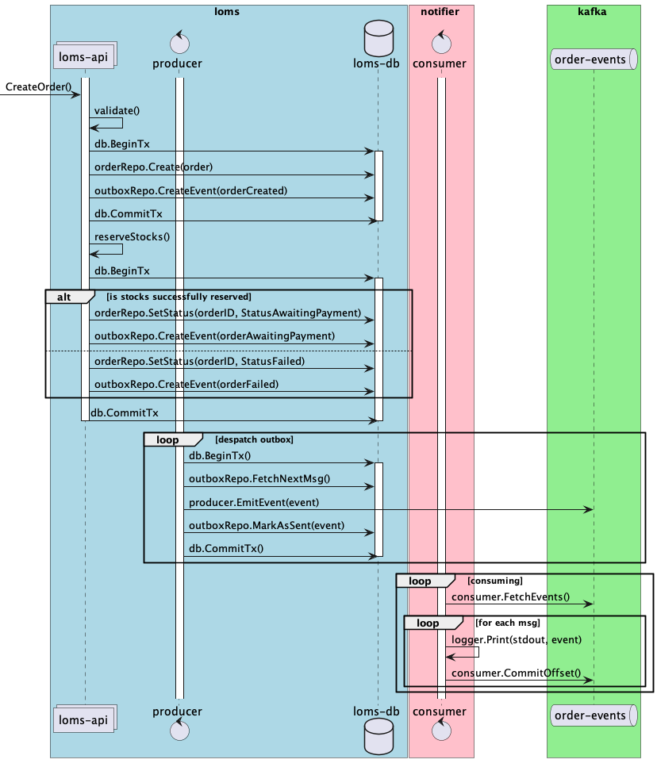

# Домашние задания по модулю "Очереди и асинхронное взаимодействие. Kafka"

## Основное задание

- необходимо добавить Apache Kafka и ее компоненты в docker окружение включая:
  - контейнер с брокером
  - контейнер с ui админкой на базе provectuslabs/kafka-ui
  - контейнер для инициализации окружения
- при старте контейнеризированного окружения должна создаваться очередь для событий связанных с заказами
  - название очереди должно быть `loms.order-events`
  - фактор репликации должен быть равен 1
  - у очереди должно быть 2 партиции
- доработать сервис loms таким образом, чтобы он отправлял события, связанные со сменой статуса заказа, в очередь
  - реализовать код отвечающий за конфигурацию и установку подключения с Kafka
  - реализовать продюсер (допускается использование как синхронного, так и асинхронного продюсера)
  - запись в БД должна гарантироваться. Если запись в БД осуществлена, то пользователь получает успешный код ответа.
    При этом в случае падения пода или иных проблем (недоступность брокера) запись в очередь может и не состояться, это
    допустимое поведение
  - не допускается отправлять события в очередь если не удалось зафиксировать состояние заказа в БД
- разработать новый сервис notifier в соответствии с описанием ниже
  - добавить новый сервис в docker окружение
  - реализовать код отвечающий за конфигурацию и за установку подключения с kafka
  - реализовать консьюмер, который будет логировать поступающие события о заказах
  - использовать consumer группу с хранением смещений в kafka
  - необходимо обрабатывать ошибки при обработке сообщений из очереди и логировать их в стандартный поток
- уровень гарантий доставки сообщений между loms и notifier может быть любым
- должно быть обеспеченно корректное завершение (gracefully shutdown) продюсера и консьюмера

## Доработки на стороне loms

При проведении операций над заказом необходимо фиксировать соответствующие события в очереди kafka.

Необходимо отправлять события при смене статуса заказа:
- создание заказа статус `new` (осуществляется внутри обработчика OrderCreate)
- завершение заказа с ошибкой, статус `failed` терминальный (не удалось зарезервировать стоки во время OrderCreate и другие ошибки)
- ожидание оплаты статус `awaiting payment` (осуществляется внутри обработчика OrderCreate)
- оплата заказа статус `payed` терминальный (осуществляется вызовом OrderPay)
- отмена заказа, статус `cancelled` терминальный (осуществляется внутри обработчика OrderCancel)

Событие (сообщение в kafka) должно содержать следующие поля:
- идентификатор заказа
- событие, которое произошло с данным заказом
- временную метку с датой и временем проведения операции
- дополнительную техническую/бизнес информацию

Должно быть обеспечено:
- приближенное к равномерному, распределение сообщений по партициям
- должен гарантироваться хронологический порядок событий в рамках одного заказа, т.е. мы не должны получить события об
  отмене заказа раньше, чем событие о его создании. При этом в рамках основной части задания сообщения могут теряться.

## Создание сервиса notifier

Необходимо:
- разработать новый сервис, настроить для него docker окружение.
- при запуске сервис подключается к kafka и запускает consumer, в рамках consumer-group
- настройки подключения и другие параметры должны браться из конфигурации, аргументов при запуске или переменных окружения
- консьюмер должен обрабатывать сообщения поступающие из очереди (которые отправляет loms продюсер). Notifier должен логировать каждое получаемое событие в стандартный поток вывода (stdout) любым удобным способом
- cервис notifier должен запускаться в 3-х экземплярах, при этом т.к. партиции всего две сообщения должны получать только два из них
- логирование должно осуществляться таким образом, чтобы все сообщения из kafka топика можно было увидеть в логах
  - либо docker контейнера с помощью команды `docker notifier-1 logs`
  - либо при непосредственном запуске сервиса notifier `go run ./cmd/notifier`

## Схема взаимодействия для основного задания

На диаграмме показано создание заказа, но аналогичным образом должны обрабатываться и другие события.

## Дополнительное задание

- необходимо обеспечить гарантию доставки не ниже "at least once"
  - в notifier в консьюмере необходимо фиксировать смещение только после успешной обработки сообщения. Допускается
    фиксировать смещение после обработки каждого сообщения, либо в фоновом процессе (autocommit).
  - на стороне loms (продюсера) необходимо реализовать tx outbox, создание/изменение заказа и запись в outbox должны
    происходить в одной транзакции
  - допускается при разборе outbox-а держать транзакцию открытой на момент отправки сообщения в очередь во избежание
    конкурентного доступа к outbox
  - допускается использовать синхронный продюсер

## Схема взаимодействия для дополнительного задания

